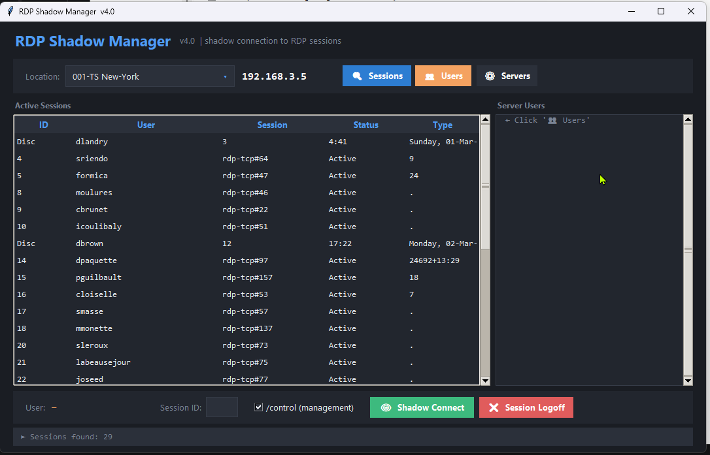
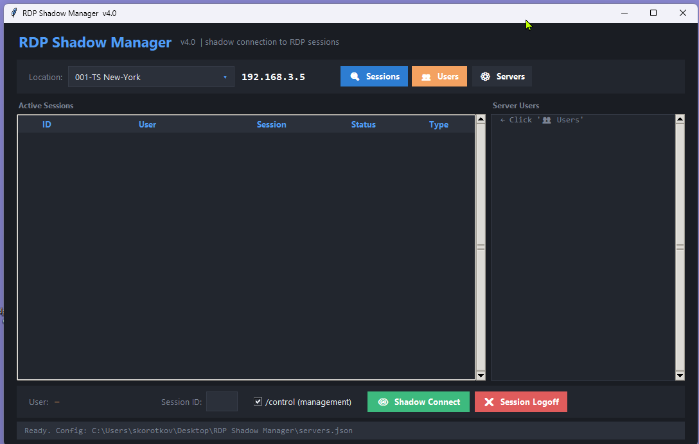

# RDP Shadow Manager
Designed for IT administrators
Simple tool for remote shadow connection to RDP sessions on Windows servers.

## Installation

- Download the ZIP from Releases
- Extract it
- Run main.exe

## Features

- View active sessions
- Shadow connect
- Control mode (/control)
- Logoff sessions
- Add custom servers

## Screenshots

## Notes

- No internet connection required
- Runs locally
- Requires admin rights for shadow
